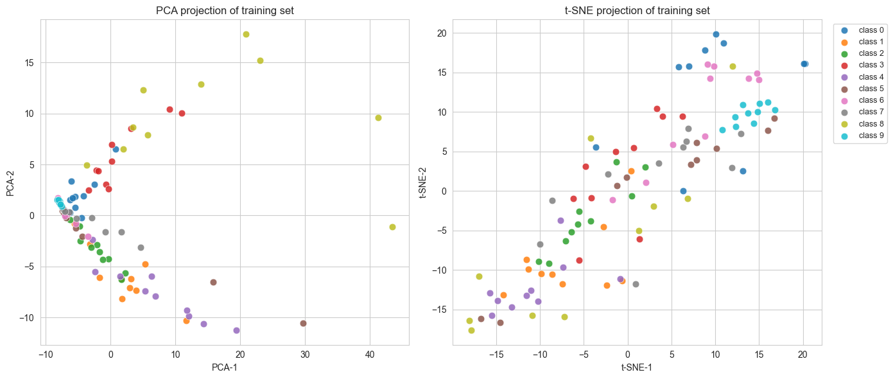
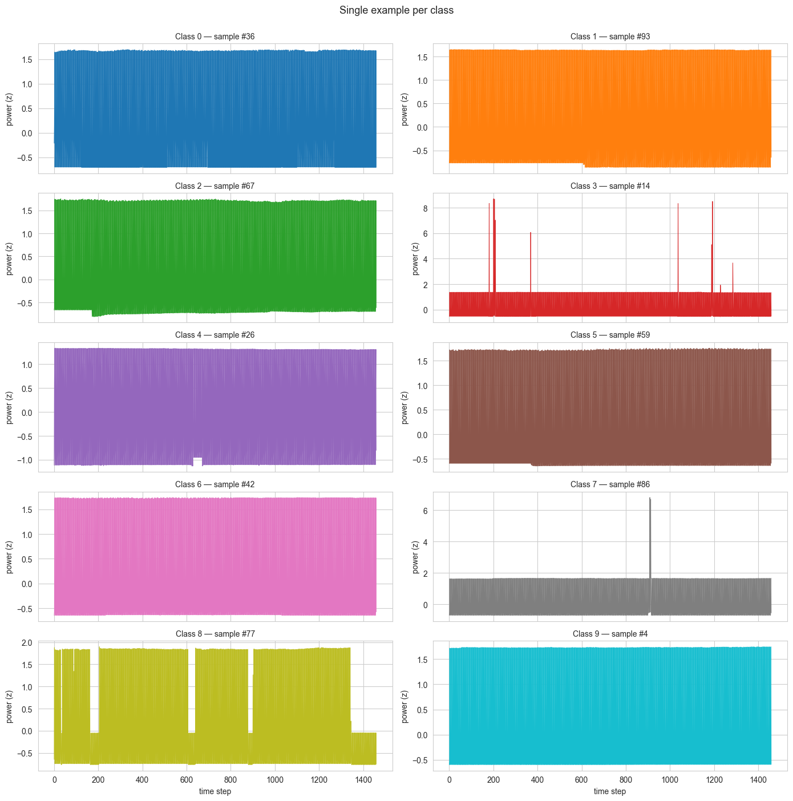
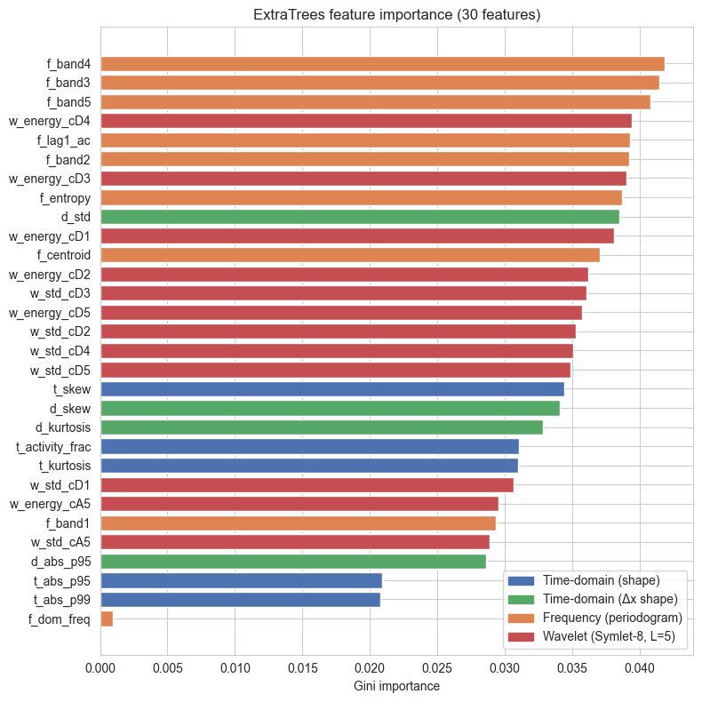
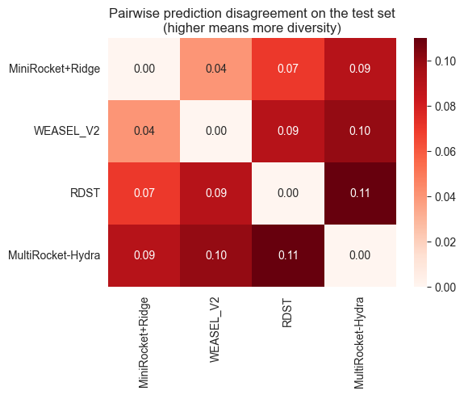

# Appliance Power Classification

Identifying which of **10 home-appliance types** produced a power-consumption trace, from **100 training samples** — 10 per class, 1460 timesteps each. The final ensemble scores **97% on the held-out competition test set**.



## The problem

Each sample is a 1460-step z-normalized power-consumption trace from one appliance: chargers, coffee machines, computer stations, fridges, Hi-Fi systems, CFL lamps, laptops, microwaves, printers, or TVs.

The difficulty is the shape of the data, not the task:

- **1460 features, 100 samples.** Fourteen times more dimensions than observations, with 10 examples per class to learn from.
- **Already z-normalized.** Amplitude — the most obvious way to tell a fridge from a phone charger — has been removed. What is left is *shape*: duty cycle, periodicity, transient structure.
- **A 5-point noise floor.** With 20 samples in a validation fold, one misclassification moves that fold's accuracy by 5 percentage points.



Some classes are visibly distinct — Class 8 switches on and off in long blocks, Classes 3 and 7 fire brief transients an order of magnitude above baseline, Classes 1, 2 and 5 shift level partway through. Others are near-indistinguishable bands of oscillation. That mix is what makes the problem interesting: the easy classes are separable by almost anything, and the accuracy is decided by the rest.

## Results

Five-fold stratified cross-validation on the 100 training samples, `random_state=42` throughout.

| Representation | Model | CV accuracy |
|---|---|---|
| Raw 1460-D series | 1-NN Euclidean | 0.44 ± 0.12 |
| Raw 1460-D series | SVM (RBF) | 0.55 ± 0.12 |
| Raw 1460-D series | Logistic Regression | 0.57 ± 0.05 |
| Raw 1460-D series | Extra Trees | 0.62 ± 0.12 |
| Raw 1460-D series | Random Forest | 0.64 ± 0.07 |
| 30 engineered features | SVM (RBF) | 0.58 ± 0.07 |
| 30 engineered features | Logistic Regression | 0.63 ± 0.08 |
| 30 engineered features | Soft vote of the four | 0.71 ± 0.07 |
| 30 engineered features | Random Forest | 0.71 ± 0.02 |
| 30 engineered features | **Extra Trees** | **0.71 ± 0.06** |
| Learned representation | RDST | 0.73 ± 0.09 |
| Learned representation | MultiRocket-Hydra | 0.75 ± 0.03 |
| Learned representation | WEASEL 2.0 | 0.76 ± 0.05 |
| Learned representation | MiniRocket + Ridge | 0.76 ± 0.06 |
| **Ensemble** | **Soft vote of the four above** | — |

Two models were submitted to the competition:

| Submission | Model | Test accuracy |
|---|---|---|
| [`submissions/ensemble-submission.csv`](submissions/ensemble-submission.csv) | Soft vote of the four modern classifiers | **0.97** |
| [`submissions/ET-submission.csv`](submissions/ET-submission.csv) | Extra Trees on 30 engineered features | 0.92 |

The two agree on 93 of 100 test samples. The ensemble is the final answer; Extra Trees is kept because a transparent 30-feature model landing within 5 points of it is a result worth reporting, not hiding.

## What actually mattered

**Raw distance fails, and it fails for a reason.** 1-NN with Euclidean distance reaches 0.44 — barely four times chance. In 1460 dimensions, straight-line distance is dominated by pointwise misalignment: two traces from the same appliance offset by a few minutes look further apart than two traces from different appliances that happen to be in phase. Logistic regression and an RBF-SVM on the raw series do no better, for the ordinary reason that 100 samples cannot pin down 1460 coefficients.

**Thirty features chosen by hand beat every raw-series model.** Not a feature dump from a library — 30 features in four physically motivated blocks, each traceable to something visible in the exploratory analysis:

| Block | Features | What it captures |
|---|---|---|
| Time-domain shape | 5 | skew, kurtosis, 95th/99th percentile of \|x\|, fraction of time above 0.5 — a duty-cycle proxy |
| First-difference shape | 4 | std, 95th percentile of \|Δx\|, skew, kurtosis — how abruptly the appliance switches |
| Periodogram | 9 | five log-spaced band energies, spectral centroid, spectral entropy, dominant frequency, lag-1 autocorrelation |
| Wavelet (Symlet-8, 5 levels) | 12 | log-energy and std of each level's coefficients — transients localized in time *and* frequency |

Extra Trees on these 30 numbers reaches 0.71, up from 0.64 on all 1460.



The frequency and wavelet blocks carry the most weight, which matches the physics: appliances differ in how often they cycle and how sharp their switching transients are. Dominant frequency alone contributes almost nothing — the single most obvious spectral feature is the least useful one here, because several classes cycle at similar rates and differ in *how* they cycle rather than how fast.

**Four different model families beat any one of them.** MiniRocket, WEASEL 2.0, RDST, and MultiRocket-Hydra sit within 3 points of each other (0.73–0.76), with no single winner. That is exactly the regime where ensembling pays — provided the models make *different* mistakes.



They do: the four disagree with each other on 4 to 11 of the 100 test samples depending on the pair, with MultiRocket-Hydra the most idiosyncratic and MiniRocket/WEASEL the most alike. Averaging their predicted class probabilities lifts the result to 0.97. Hard voting produces identical predictions on all 100 samples here; soft voting is kept as the safer default, since it can break ties that a count of votes cannot.

Notably, the same trick applied to the *feature-space* models does not work: soft-voting Logistic Regression, Random Forest, SVM, and Extra Trees over the 30 features gives 0.71 — no better than Extra Trees alone. Diversity of representation is what helped, not diversity of classifier.

## Why cross-validation said 0.76 and the test set said 0.97

That gap is large enough to explain rather than celebrate.

1. **Every CV fold trains on 80 samples; the final model trains on 100.** At this sample size, 25% more training data matters — the learning curve is nowhere near flat.
2. **Each fold's estimate is coarse.** Twenty validation samples means accuracy is quantized to 5-point steps, and the fold-to-fold standard deviations (2–12 points) reflect that granularity as much as any real instability.
3. **The train/test split is curated, not random.** This is a benchmark dataset with a fixed published split, so cross-validation on the training half is not estimating the same quantity the leaderboard measures.

The honest reading: cross-validation was a conservative *lower bound*, useful for ranking models against each other. Differences under about 2 points were treated as noise, and no model was selected on the basis of test-set performance.

## Reproducing

```bash
git clone https://github.com/Abdelmalek05/appliance-power-classification.git
cd appliance-power-classification
python -m venv .venv
source .venv/bin/activate          # Windows: .venv\Scripts\activate
pip install -r requirements.txt
jupyter nbconvert --to notebook --execute notebook.ipynb --inplace
```

Runs top to bottom in **under three minutes** on a laptop CPU (164 seconds measured) and rewrites both files in `submissions/` — byte-identically, verified. Everything is seeded with `random_state=42`.

`torch` is in the requirements because aeon implements Hydra as a `torch.nn.Module`; the CPU-only wheels are sufficient and much smaller:

```bash
pip install torch==2.11.0 --index-url https://download.pytorch.org/whl/cpu
```

Or open the notebook in Colab — it clones this repo for its data:

[](https://colab.research.google.com/github/Abdelmalek05/appliance-power-classification/blob/main/notebook.ipynb)

## Data

`data/train.csv` and `data/test.csv` are the course-competition distribution of **ACSF1** (Appliance Consumption Signatures Fingerprint) from the UCR Time Series Classification Archive: 100 training and 100 test traces, 1460 timesteps, 10 balanced classes, z-normalized. See [`data/README.md`](data/README.md) for the exact file format — both files have loading quirks — and the citation.

All model selection here used 5-fold cross-validation on the 100 training samples. The test labels are not part of this repository and were not used for training, tuning, or model choice.

## Notebook contents

| Section | What it covers |
|---|---|
| 1–2 | Setup and data loading |
| 3 | Exploratory analysis — example traces, PCA/t-SNE, summary statistics, periodograms |
| 4 | Five baselines on the raw 1460-D series |
| 5 | 30 engineered features; four classifiers compared; Extra Trees selected |
| 6 | MiniRocket, WEASEL 2.0, RDST, MultiRocket-Hydra, then the soft-vote ensemble |
| 7 | Confusion matrix, model agreement analysis, summary table |
| 8 | Conclusion and references |

## Author

**Abdelmalek Nedjar**

Group project for the Time Series Analysis and Classification module at **ENSIA** (École Nationale Supérieure d'Intelligence Artificielle), 2026. The work was done in a two-person team, with each member publishing their own copy of the project.

## References

1. Dempster, A., Schmidt, D. F., & Webb, G. I. *MiniRocket: A very fast (almost) deterministic transform for time series classification.* KDD 2021.
2. Schäfer, P., & Leser, U. *WEASEL 2.0 — A random dilated dictionary transform for fast, accurate and memory constrained time series classification.* Machine Learning 112(12), 2023.
3. Guillaume, A., Vrain, C., & Elloumi, W. *Random Dilated Shapelet Transform: A new approach for time series shapelets.* ICPRAI 2022.
4. Dempster, A., Schmidt, D. F., & Webb, G. I. *Hydra: competing convolutional kernels for fast and accurate time series classification.* Data Mining and Knowledge Discovery 37, 2023.
5. Dau, H. A. et al. *The UCR Time Series Archive.* IEEE/CAA Journal of Automatica Sinica 6(6), 2019.

## License

MIT — see [LICENSE](LICENSE).
